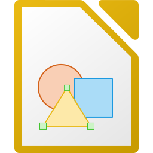

_🇬🇧 For English, see [README.md](README.md)_

_🇳🇱 Voor Nederlands, zie [README-nl.md](README-nl.md)_

<table>
<tr><th colspan="2"> </th><th> Replaces</th></tr>
<tr><td></td>
<td valign="top"><a target="_blank" href="https://www.mozilla.com/firefox/"><strong>Firefox</strong></a> 
</td>
<td valign="top"><strong>Microsoft Edge, Google Chrome, Apple Safari</strong></td></tr>
<tr><td></td>
<td valign="top"><a target="_blank" href="https://ungoogled-software.github.io/ungoogled-chromium-binaries/"><strong>Ungoogled Chromium</strong></a> 
</td>
<td valign="top"><strong>Microsoft Edge, Google Chrome, Apple Safari</strong></td></tr>
<tr><th colspan="2"> </th><th> Replaces</th></tr>
<tr><td></td>
<td valign="top"><a target="_blank" href="https://www.thunderbird.net/"><strong>Thunderbird</strong></a> 
</td>
<td valign="top"><strong>Microsoft Outlook, (Google) Gmail, Google Calendar, Mail, Address Book, iCal</strong></td></tr>
<tr><th colspan="2"> </th><th> Replaces</th></tr>
<tr><td></td>
<td valign="top"><a target="_blank" href="https://www.videolan.org/vlc/"><strong>VLC</strong></a> 
</td>
<td valign="top"><strong>Microsoft Media Player, Winamp, QuickTime, DVD Player, iTunes</strong></td></tr>
<tr><td></td>
<td valign="top"><a target="_blank" href="https://mpv.io/"><strong>MPV</strong></a> 
</td>
<td valign="top"><strong>Microsoft Media Player, Winamp, QuickTime, DVD Player, iTunes</strong></td></tr>
<tr><td></td>
<td valign="top"><a target="_blank" href="https://kodi.tv/"><strong>Kodi</strong></a> 
</td>
<td valign="top"><strong>Microsoft Media Player, Winamp, QuickTime, DVD Player, iTunes</strong></td></tr>
<tr><th colspan="2"> </th><th> Replaces</th></tr>
<tr><td></td>
<td valign="top"><a target="_blank" href="https://obsproject.com/"><strong>OBS Studio</strong></a> 
</td>
<td valign="top"><strong>Camtasia, Snagit</strong></td></tr>
<tr><td></td>
<td valign="top"><a target="_blank" href="https://www.shotcut.org/"><strong>Shotcut</strong></a> 
</td>
<td valign="top"><strong>Adobe Premiere Pro, Windows Movie Maker, iMovie, Pinnacle Studio, DaVinci Resolve</strong></td></tr>
<tr><td></td>
<td valign="top"><a target="_blank" href="https://www.audacityteam.org/"><strong>Audacity</strong></a> 
</td>
<td valign="top"><strong>Adobe Soundbooth, GarageBand, Sony Sound Forge</strong></td></tr>
<tr><td></td>
<td valign="top"><a target="_blank" href="https://mediaarea.net/MediaInfo"><strong>Mediainfo</strong></a> 
</td>
<td valign="top"><strong>Microsoft Media Player, Winamp, QuickTime, DVD Player, iTunes</strong></td></tr>
<tr><th colspan="2"> </th><th> Replaces</th></tr>
<tr><td></td>
<td valign="top"><a target="_blank" href="https://www.libreoffice.org/"><strong>LibreOffice Writer</strong></a> 
</td>
<td valign="top"><strong>Microsoft Office Word</strong></td></tr>
<tr><td></td>
<td valign="top"><a target="_blank" href="https://www.libreoffice.org/"><strong>LibreOffice Calc</strong></a> 
</td>
<td valign="top"><strong>Microsoft Office Excel</strong></td></tr>
<tr><td></td>
<td valign="top"><a target="_blank" href="https://www.libreoffice.org/"><strong>LibreOffice Impress</strong></a> 
</td>
<td valign="top"><strong>Microsoft Office PowerPoint</strong></td></tr>
<tr><td></td>
<td valign="top"><a target="_blank" href="https://www.libreoffice.org/"><strong>LibreOffice Base</strong></a> 
</td>
<td valign="top"><strong>Microsoft Office Access</strong></td></tr>
<tr><td></td>
<td valign="top"><a target="_blank" href="https://www.libreoffice.org/"><strong>LibreOffice Draw</strong></a> 
</td>
<td valign="top"><strong>Microsoft Office Draw</strong></td></tr>
<tr><td></td>
<td valign="top"><a target="_blank" href="https://www.libreoffice.org/"><strong>LibreOffice Math</strong></a> 
</td>
<td valign="top"><strong>Microsoft Office MathTyoe</strong></td></tr>
<tr><th colspan="2"> </th><th> Replaces</th></tr>
<tr><td></td>
<td valign="top"><a target="_blank" href="https://gimp.org/"><strong>GIMP</strong></a> 
</td>
<td valign="top"><strong>Adobe Illustrator, Corel Paint Shop Pro Photo</strong></td></tr>
<tr><td></td>
<td valign="top"><a target="_blank" href="https://inkscape.org/"><strong>Inkscape</strong></a> 
</td>
<td valign="top"><strong>Adobe Illustrator, Adobe Fireworks, CorelDRAW</strong></td></tr>
<tr><td></td>
<td valign="top"><a target="_blank" href="https://krita.org/"><strong>Krita</strong></a> 
</td>
<td valign="top"><strong>Microsoft Paint, Painting</strong></td></tr>
<tr><td></td>
<td valign="top"><a target="_blank" href="https://scribus.net/"><strong>Scribus</strong></a> 
</td>
<td valign="top"><strong>Adobe InDesign, Adobe FrameMaker, QuarkXPress</strong></td></tr>
<tr><th colspan="2"> </th><th> Replaces</th></tr>
<tr><td></td>
<td valign="top"><a target="_blank" href="https://www.dash.org/"><strong>Dash</strong></a> 
</td>
<td valign="top"><strong>PayPal</strong></td></tr>
<tr><td></td>
<td valign="top"><a target="_blank" href="https://firo.org/"><strong>Firo</strong></a> 
</td>
<td valign="top"><strong>PayPal</strong></td></tr>
<tr><th colspan="2"> </th><th> Replaces</th></tr>
<tr><td></td>
<td valign="top"><a target="_blank" href="https://www.7-zip.org/"><strong>7-Zip</strong></a> 
</td>
<td valign="top"><strong>WinZip, WinZip PDF Pro</strong></td></tr>
<tr><td></td>
<td valign="top"><a target="_blank" href="https://filezilla-project.org/"><strong>FileZilla</strong></a> 
</td>
<td valign="top"><strong>WinFTP, Duck</strong></td></tr>
<tr><td></td>
<td valign="top"><a target="_blank" href="https://www.clamwin.com/"><strong>ClamWin</strong></a> 
</td>
<td valign="top"><strong>McAfee VirusScan, Semantec Norton AntiVirus</strong></td></tr>
<tr><td></td>
<td valign="top"><a target="_blank" href="https://clamtk.sourceforge.net/"><strong>ClamTk</strong></a> 
</td>
<td valign="top"><strong>McAfee VirusScan, Semantec Norton AntiVirus</strong></td></tr>
<tr><td></td>
<td valign="top"><a target="_blank" href="https://www.syncthing.org/"><strong>Syncthing</strong></a> 
</td>
<td valign="top"><strong>Dropbox, Google Drive, Microsoft OneDrive, Yandex Disk, Yandex Cloud</strong></td></tr>
<tr><td></td>
<td valign="top"><a target="_blank" href="https://www.jscreenfix.com/"><strong>JScreenFix</strong></a> 
</td>
<td valign="top"><strong></strong></td></tr>
</table>

