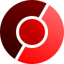
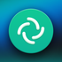
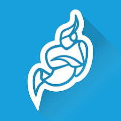
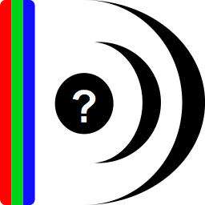
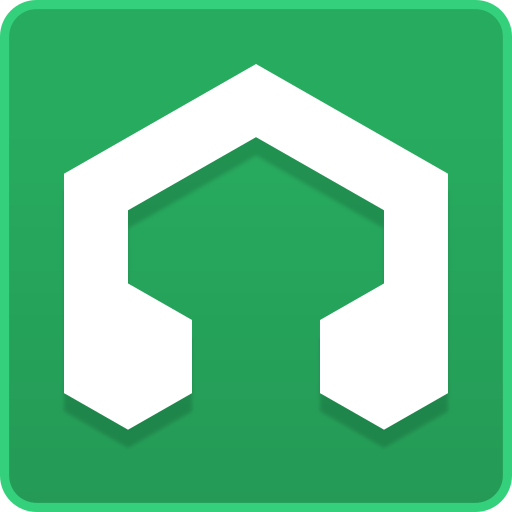
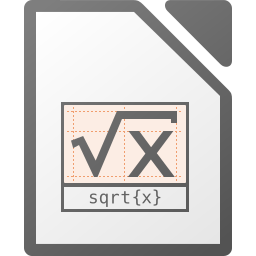
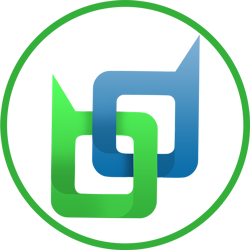

_🇬🇧 For English, see [README.md](README.md)_

_🇪🇸 Para español, ver [README-es.md](README-es.md)_

# FOSS

**Selectie van FOSS voor Windows, macOS en Linux**

> <em>Het geheim van geluk is vrijheid. Het geheim van vrijheid is moed.</em> — Thucydides (460 – 395 v.Chr.) Griekse historicus en schrijver in Athene

Het is om verschillende reden aan te bevelen om onderstaande <a target="_blank" href="https://nl.wikipedia.org/wiki/Vrije_software_en_opensourcesoftware">vrije opensourcesoftware</a> (FOSS) te gebruiken. Deze softwarepakketten zijn gratis te gebruiken op besturingssystemen zoals [Windows](https://microsoft.com/netherlands/windows/), [macOS](https://apple.com/macos/) en [Linux](https://pop.system76.com/). De software hieronder is legaal, van hoge kwaliteit en garanderen meer vrijheid voor de gebruiker.

<table>
<tr><th colspan="2"> Bestanden</th><th> Vervangt</th></tr>
<tr><td></td>
<td valign="top"><a target="_blank" href="https://www.syncthing.org/"><strong>Syncthing</strong></a> 
synchroniseer en back-up bestanden</td>
<td valign="top"><strong>Dropbox, Google Drive, Microsoft OneDrive, Yandex Disk, Yandex Cloud</strong></td></tr>
<tr><td></td>
<td valign="top"><a target="_blank" href="https://www.7-zip.org/"><strong>7-Zip</strong></a> 
pak zipbestanden in en uit</td>
<td valign="top"><strong>WinZip, WinZip PDF Pro</strong></td></tr>
<tr><td></td>
<td valign="top"><a target="_blank" href="https://filezilla-project.org/"><strong>FileZilla</strong></a> 
kopieer bestanden naar en van een server</td>
<td valign="top"><strong>WinFTP, Duck</strong></td></tr>
<tr><td></td>
<td valign="top"><a target="_blank" href="https://www.clamav.net/"><strong>Clam AntiVirus</strong></a> 
scan bestanden voor virussen</td>
<td valign="top"><strong>McAfee VirusScan, Norton AntiVirus</strong></td></tr>
<tr><th colspan="2"> Webbrowsers</th><th> Vervangt</th></tr>
<tr><td></td>
<td valign="top"><a target="_blank" href="https://www.mozilla.com/firefox/"><strong>Firefox</strong></a> 
browse het internet, inclusief Firefox Sync voor synchroniseren wachtwoorden, favorieten, instellingen, etc.</td>
<td valign="top"><strong>Microsoft Edge, Google Chrome, Apple Safari</strong></td></tr>
<tr><td></td>
<td valign="top"><a target="_blank" href="https://ungoogled-software.github.io/ungoogled-chromium-binaries/"><strong>Ungoogled Chromium</strong></a> 
browse het internet zonder integratie van Google</td>
<td valign="top"><strong>Microsoft Edge, Google Chrome, Apple Safari</strong></td></tr>
<tr><td></td>
<td valign="top"><a target="_blank" href="https://keepassxc.org/"><strong>KeepassXC</strong></a> 
beheer wachtwoorden</td>
<td valign="top"><strong>Google Password Manager, Microsoft Authenticator, LastPass, 1Password, Bitwarden Password Manager, Yandex Key</strong></td></tr>
<tr><th colspan="2"> E-mail, Contacten, Kalender en Taken</th><th> Vervangt</th></tr>
<tr><td></td>
<td valign="top"><a target="_blank" href="https://www.thunderbird.net/"><strong>Thunderbird</strong></a> 
ontvang en verstuur e-mails, beheren contacten (CardDAV) en beheer kalenders en taken (CalDAV, ICS)</td>
<td valign="top"><strong>Microsoft Outlook, (Google) Gmail, Google Calendar, Mail, Address Book, iCal</strong></td></tr>
<tr><th colspan="2"> Messaging en communicatie</th><th> Vervangt</th></tr>
<tr><td></td>
<td valign="top"><a target="_blank" href="https://mattermost.com/"><strong>Mattermost</strong></a> 
</td>
<td valign="top"><strong></strong></td></tr>
<tr><td></td>
<td valign="top"><a target="_blank" href="https://telegram.org/"><strong>Telegram</strong></a> 
instant messaging, bellen en videobellen</td>
<td valign="top"><strong>WhatsApp, Facebook Messenger, Zoom, Discord, Google Meet, Google Hangouts, Instagram, Snapchat, LINE, Skype</strong></td></tr>
<tr><td></td>
<td valign="top"><a target="_blank" href="https://element.io/"><strong>Element</strong></a> 
instant messaging met Matrix</td>
<td valign="top"><strong>WhatsApp, Google Meet, Zoom, Discord, Slack, Viber</strong></td></tr>
<tr><td></td>
<td valign="top"><a target="_blank" href="https://element.io/"><strong>Element X</strong></a> 
instant messaging met Matrix</td>
<td valign="top"><strong>WhatsApp, Google Meet, Zoom, Discord, Slack, Viber</strong></td></tr>
<tr><td></td>
<td valign="top"><a target="_blank" href="https://jitsi.org/jitsi-meet/"><strong>Jitsi Meet</strong></a> 
videoconferentie</td>
<td valign="top"><strong>Zoom, Microsoft Teams, Google Meet, Discord, Skype</strong></td></tr>
<tr><th colspan="2"> Mediaspelers</th><th> Vervangt</th></tr>
<tr><td></td>
<td valign="top"><a target="_blank" href="https://www.videolan.org/vlc/"><strong>VLC</strong></a> 
speel video of audio af van bestanden of streams</td>
<td valign="top"><strong>Microsoft Media Player, Winamp, QuickTime, DVD Player, iTunes</strong></td></tr>
<tr><td></td>
<td valign="top"><a target="_blank" href="https://mpv.io/"><strong>MPV</strong></a> 
speel video of audio af van bestanden of streams, ondersteunt dubbele ondertiteling</td>
<td valign="top"><strong>Microsoft Media Player, Winamp, QuickTime, DVD Player, iTunes</strong></td></tr>
<tr><td></td>
<td valign="top"><a target="_blank" href="https://kodi.tv/"><strong>Kodi</strong></a> 
speel video of audio af van bestanden of streams, inclusief info en filmposters van TMDb </td>
<td valign="top"><strong>Microsoft Media Player, Winamp, QuickTime, DVD Player, iTunes</strong></td></tr>
<tr><th colspan="2"> Video-opname en -bewerking</th><th> Vervangt</th></tr>
<tr><td></td>
<td valign="top"><a target="_blank" href="https://obsproject.com/"><strong>OBS Studio</strong></a> 
neem video's op en stream video's</td>
<td valign="top"><strong>Camtasia, Snagit</strong></td></tr>
<tr><td></td>
<td valign="top"><a target="_blank" href="https://www.shotcut.org/"><strong>Shotcut</strong></a> 
bewerk video's</td>
<td valign="top"><strong>Adobe Premiere Pro, Windows Movie Maker, iMovie, Pinnacle Studio, DaVinci Resolve</strong></td></tr>
<tr><td></td>
<td valign="top"><a target="_blank" href="https://www.audacityteam.org/"><strong>Audacity</strong></a> 
bewerk audiobestanden</td>
<td valign="top"><strong>Adobe Soundbooth, GarageBand, Sony Sound Forge</strong></td></tr>
<tr><td></td>
<td valign="top"><a target="_blank" href="https://mediaarea.net/MediaInfo"><strong>Mediainfo</strong></a> 
inspecteer mediabestanden</td>
<td valign="top"><strong>Microsoft Media Player, Winamp, QuickTime, DVD Player, iTunes</strong></td></tr>
<tr><td></td>
<td valign="top"><a target="_blank" href="https://lmms.io/"><strong>LMMS</strong></a> 
maak en arrangeer muziek</td>
<td valign="top"><strong>Ableton Live, Adobe Audition, GarageBand</strong></td></tr>
<tr><th colspan="2"> Officepakket</th><th> Vervangt</th></tr>
<tr><td></td>
<td valign="top"><a target="_blank" href="https://www.libreoffice.org/"><strong>LibreOffice Writer</strong></a> 
tekstverwerker</td>
<td valign="top"><strong>Microsoft Office Word</strong></td></tr>
<tr><td></td>
<td valign="top"><a target="_blank" href="https://www.libreoffice.org/"><strong>LibreOffice Calc</strong></a> 
rekenblad</td>
<td valign="top"><strong>Microsoft Office Excel</strong></td></tr>
<tr><td></td>
<td valign="top"><a target="_blank" href="https://www.libreoffice.org/"><strong>LibreOffice Impress</strong></a> 
presentatie</td>
<td valign="top"><strong>Microsoft Office PowerPoint</strong></td></tr>
<tr><td></td>
<td valign="top"><a target="_blank" href="https://www.libreoffice.org/"><strong>LibreOffice Base</strong></a> 
database</td>
<td valign="top"><strong>Microsoft Office Access</strong></td></tr>
<tr><td></td>
<td valign="top"><a target="_blank" href="https://www.libreoffice.org/"><strong>LibreOffice Draw</strong></a> 
tekenen</td>
<td valign="top"><strong>Microsoft Office Draw</strong></td></tr>
<tr><td></td>
<td valign="top"><a target="_blank" href="https://www.libreoffice.org/"><strong>LibreOffice Math</strong></a> 
wiskundige formules</td>
<td valign="top"><strong>Microsoft Office MathTyoe</strong></td></tr>
<tr><th colspan="2"> Grafish en publicatie</th><th> Vervangt</th></tr>
<tr><td></td>
<td valign="top"><a target="_blank" href="https://gimp.org/"><strong>GIMP</strong></a> 
tekenprogramma, beeldmanipulatie</td>
<td valign="top"><strong>Adobe Illustrator, Corel Paint Shop Pro Photo</strong></td></tr>
<tr><td></td>
<td valign="top"><a target="_blank" href="https://inkscape.org/"><strong>Inkscape</strong></a> 
vectortekenen</td>
<td valign="top"><strong>Adobe Illustrator, Adobe Fireworks, CorelDRAW</strong></td></tr>
<tr><td></td>
<td valign="top"><a target="_blank" href="https://krita.org/"><strong>Krita</strong></a> 
tekenen</td>
<td valign="top"><strong>Microsoft Paint, Painting</strong></td></tr>
<tr><td></td>
<td valign="top"><a target="_blank" href="https://scribus.net/"><strong>Scribus</strong></a> 
desktop-publishing (DTP)</td>
<td valign="top"><strong>Adobe InDesign, Adobe FrameMaker, QuarkXPress</strong></td></tr>
<tr><th colspan="2"> Financieel</th><th> Vervangt</th></tr>
<tr><td></td>
<td valign="top"><a target="_blank" href="https://www.dash.org/"><strong>Dash</strong></a> 
verstuur en ontvang anoniem de cryptovaluta Dash</td>
<td valign="top"><strong>PayPal, American Express, Visa, Mastercard, Bitcoin</strong></td></tr>
<tr><td></td>
<td valign="top"><a target="_blank" href="https://firo.org/"><strong>Firo</strong></a> 
verstuur en ontvang anoniem de cryptovaluta Firo</td>
<td valign="top"><strong>PayPal, American Express, Visa, Mastercard, Bitcoin</strong></td></tr>
<tr><td></td>
<td valign="top"><a target="_blank" href="https://beldex.io/"><strong>Beldex</strong></a> 
verstuur en ontvang anoniem de cryptovaluta Beldex</td>
<td valign="top"><strong>PayPal, American Express, Visa, Mastercard, Bitcoin</strong></td></tr>
<tr><td></td>
<td valign="top"><a target="_blank" href="https://www.getmonero.org/"><strong>Monero</strong></a> 
verstuur en ontvang anoniem de cryptovaluta Monero</td>
<td valign="top"><strong>PayPal, American Express, Visa, Mastercard, Bitcoin</strong></td></tr>
</table>

Overweeg ook om de volgende [Firefox add-ons](https://addons.mozilla.org/en-US/firefox/collections/Hellebaard/favorites/) en [Thunderbird add-ons](https://addons.thunderbird.net/en-US/thunderbird/collections/Hellebaard/favorites/) te installeren.

Zie ook:
- [Selectie van FOSS Androidapps op F-Droid](https://github.com/PanderMusubi/fdroid/blob/main/README-nl.md)
- [PRISM Break](https://prism-break.org/nl/

Dit overzicht was gestarted in 2013 en was eerder dan die van PRISM Break.

