_🇪🇸 Para español, ver [README-es.md](README-es.md)_

_🇳🇱 Voor Nederlands, zie [README-nl.md](README-nl.md)_

# FOSS

**Selection of FOSS for Windows, macOS and Linux**

> <em>The secret of happiness is freedom. The secret of freedom is courage.</em> — Thucydides (460 – 395 BC) Greek historian and author in Athens

For several reasons it is advisable to user the <a target="_blank" href="https://en.wikipedia.org/wiki/Free_and_open-source_software">free and open source software</a> (FOSS) listed below. These software packages can be used free of charge on all operating systems, such as [Windows](https://microsoft.com/windows/), [macOS](https://apple.com/macos/) and [Linux](https://pop.system76.com/). The software packages below are legal, of high quality and guarantee more freedom for the user.

The additional links under the application description are:
- AP for the APT
- FL for flathub.org
- SN for snapcraft.io
- AT for alternative.to
- OA for os.alternative.to

<table>
<tr><th colspan="2"> Files</th><th> Replaces</th></tr>
<tr id="syncthing"><td><a target="_blank" href="https://www.syncthing.org/">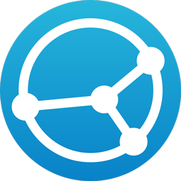</a></td>
<td valign="top"><a target="_blank" href="https://www.syncthing.org/"><strong>Syncthing</strong></a> 
synchronize and backup files <small><a target="_blank" href="https://snapcraft.io/syncthing-gael">SC</a> <a target="_blank" href="https://alternativeto.net/software/syncthing/about/">AT</a></small></td>
<td valign="top"><strong>Dropbox, Google Drive, Microsoft OneDrive, Yandex Disk, Yandex Cloud</strong></td></tr>
<tr id="7-zip"><td></td>
<td valign="top"><a target="_blank" href="https://www.7-zip.org/"><strong>7-Zip</strong></a> 
create and extract zip files <small><a target="_blank" href="https://alternativeto.net/software/7-zip/about/">AT</a></small></td>
<td valign="top"><strong>WinZip, WinZip PDF Pro</strong></td></tr>
<tr id="filezilla"><td></td>
<td valign="top"><a target="_blank" href="https://filezilla-project.org/"><strong>FileZilla</strong></a> 
copy files to and from a server <small><a target="_blank" href="https://flathub.org/apps/org.filezillaproject.Filezilla">FH</a> <a target="_blank" href="https://alternativeto.net/software/filezilla/about/">AT</a></small></td>
<td valign="top"><strong>WinFTP, Duck</strong></td></tr>
<tr id="clam-antivirus"><td><a target="_blank" href="https://www.clamav.net/">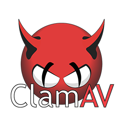</a></td>
<td valign="top"><a target="_blank" href="https://www.clamav.net/"><strong>Clam AntiVirus</strong></a> 
scan files for virusses <small><a target="_blank" href="https://alternativeto.net/software/clam-antivirus/about/">AT</a> <a target="_blank" href="https://osalternative.to/project/clam-antivirus">OA</a></small></td>
<td valign="top"><strong>McAfee VirusScan, Norton AntiVirus</strong></td></tr>
<tr><th colspan="2"> Web Browsers</th><th> Replaces</th></tr>
<tr id="firefox"><td></td>
<td valign="top"><a target="_blank" href="https://www.mozilla.com/firefox/"><strong>Firefox</strong></a> 
browse the internet, including [Firefox Sync](https://alternativeto.net/software/firefox-sync/about/) for synchronizing passwords, bookmarks, settings, etc. <small><a target="_blank" href="https://flathub.org/apps/org.mozilla.firefox">FH</a> <a target="_blank" href="https://snapcraft.io/firefox">SC</a> <a target="_blank" href="https://alternativeto.net/software/firefox/about/">AT</a></small></td>
<td valign="top"><strong>Microsoft Edge, Google Chrome, Apple Safari</strong></td></tr>
<tr id="ungoogled-chromium"><td></td>
<td valign="top"><a target="_blank" href="https://ungoogled-software.github.io/ungoogled-chromium-binaries/"><strong>Ungoogled Chromium</strong></a> 
browse the internet without integration of Google <small><a target="_blank" href="https://flathub.org/apps/io.github.ungoogled_software.ungoogled_chromium">FH</a> <a target="_blank" href="https://alternativeto.net/software/ungoogled-chromium/about/">AT</a></small></td>
<td valign="top"><strong>Microsoft Edge, Google Chrome, Apple Safari</strong></td></tr>
<tr id="keepassxc"><td></td>
<td valign="top"><a target="_blank" href="https://keepassxc.org/"><strong>KeepassXC</strong></a> 
manage passwords <small><a target="_blank" href="https://flathub.org/apps/org.keepassxc.KeePassXC">FH</a> <a target="_blank" href="https://snapcraft.io/keepassxc">SC</a> <a target="_blank" href="https://alternativeto.net/software/keepassxc/about/">AT</a> <a target="_blank" href="https://osalternative.to/project/keepassxc">OA</a></small></td>
<td valign="top"><strong>Google Password Manager, Microsoft Authenticator, LastPass, 1Password, Bitwarden Password Manager, Yandex Key</strong></td></tr>
<tr><th colspan="2"> Email, Contacts, Calendar and Tasks</th><th> Replaces</th></tr>
<tr id="thunderbird"><td></td>
<td valign="top"><a target="_blank" href="https://www.thunderbird.net/"><strong>Thunderbird</strong></a> 
send and receive emails, managing contacts (CardDAV) and manage calendars and tasks (CalDAV, ICS) <small><a target="_blank" href="https://flathub.org/apps/org.mozilla.Thunderbird">FH</a> <a target="_blank" href="https://snapcraft.io/thunderbird">SC</a> <a target="_blank" href="https://alternativeto.net/software/mozilla-thunderbird/about/">AT</a></small></td>
<td valign="top"><strong>Microsoft Outlook, (Google) Gmail, Google Calendar, Mail, Address Book, iCal</strong></td></tr>
<tr><th colspan="2"> Messaging and Communication</th><th> Replaces</th></tr>
<tr id="signal"><td></td>
<td valign="top"><a target="_blank" href="https://signal.org/"><strong>Signal</strong></a> 
instant messaging, voice and video calling <small><a target="_blank" href="https://github.com/PanderMusubi/fdroid/blob/main/README.md#signal">MB</a> <a target="_blank" href="https://flathub.org/apps/org.signal.Signal">FH</a> <a target="_blank" href="https://snapcraft.io/signal-desktop">SC</a> <a target="_blank" href="https://alternativeto.net/software/signal-private-messenger/about/">AT</a></small></td>
<td valign="top"><strong>WhatsApp, Facebook Messenger, Zoom, Discord, Google Meet, Google Hangouts, Instagram, Snapchat, LINE, Skype</strong></td></tr>
<tr id="telegram"><td></td>
<td valign="top"><a target="_blank" href="https://telegram.org/"><strong>Telegram</strong></a> 
instant messaging, voice and video calling <small><a target="_blank" href="https://github.com/PanderMusubi/fdroid/blob/main/README.md#forkgram">MB</a> <a target="_blank" href="https://flathub.org/apps/org.telegram.desktop">FH</a> <a target="_blank" href="https://snapcraft.io/telegram-desktop">SC</a> <a target="_blank" href="https://alternativeto.net/software/telegram/about/">AT</a></small></td>
<td valign="top"><strong>WhatsApp, Facebook Messenger, Zoom, Discord, Google Meet, Google Hangouts, Instagram, Snapchat, LINE, Skype</strong></td></tr>
<tr id="briar"><td></td>
<td valign="top"><a target="_blank" href="https://briarproject.org/"><strong>Briar</strong></a> 
peer-to-peer messaging <small><a target="_blank" href="https://github.com/PanderMusubi/fdroid/blob/main/README.md#briar">MB</a> <a target="_blank" href="https://flathub.org/apps/org.briarproject.Briar">FH</a> <a target="_blank" href="https://alternativeto.net/software/briar/about/">AT</a></small></td>
<td valign="top"><strong>WhatsApp, Facebook Messenger, Zoom, Discord, Google Meet, Google Hangouts, Instagram, Snapchat, LINE, Skype</strong></td></tr>
<tr id="mattermost"><td></td>
<td valign="top"><a target="_blank" href="https://mattermost.com/"><strong>Mattermost</strong></a> 
 <small><a target="_blank" href="https://github.com/PanderMusubi/fdroid/blob/main/README.md#mattermost">MB</a> <a target="_blank" href="https://flathub.org/apps/com.mattermost.Desktop">FH</a> <a target="_blank" href="https://snapcraft.io/mattermost-desktop">SC</a> <a target="_blank" href="https://alternativeto.net/software/mattermost/about/">AT</a> <a target="_blank" href="https://osalternative.to/project/mattermost">OA</a></small></td>
<td valign="top"><strong></strong></td></tr>
<tr id="element"><td><a target="_blank" href="https://element.io/">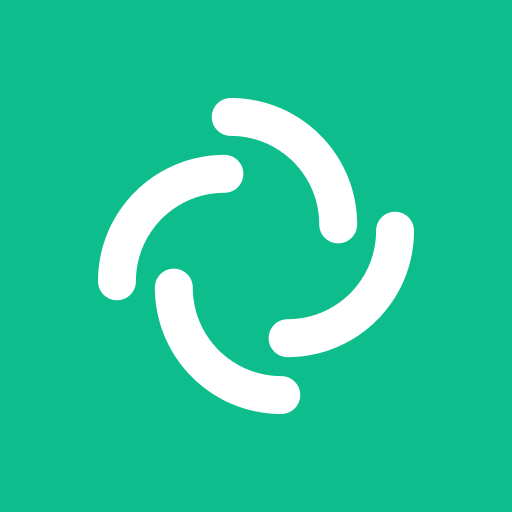</a></td>
<td valign="top"><a target="_blank" href="https://element.io/"><strong>Element</strong></a> 
instant messaging with Matrix <small><a target="_blank" href="https://github.com/PanderMusubi/fdroid/blob/main/README.md#element">MB</a> <a target="_blank" href="https://flathub.org/apps/im.riot.Riot">FH</a> <a target="_blank" href="https://snapcraft.io/element-desktop">SC</a> <a target="_blank" href="https://alternativeto.net/software/element-app/about/">AT</a> <a target="_blank" href="https://osalternative.to/project/element-app">OA</a></small></td>
<td valign="top"><strong>WhatsApp, Google Meet, Zoom, Discord, Slack, Viber</strong></td></tr>
<tr id="element-x"><td></td>
<td valign="top"><a target="_blank" href="https://element.io/"><strong>Element X</strong></a> 
instant messaging with Matrix <small><a target="_blank" href="https://github.com/PanderMusubi/fdroid/blob/main/README.md#element-x">MB</a> <a target="_blank" href="https://alternativeto.net/software/element-x/about/">AT</a></small></td>
<td valign="top"><strong>WhatsApp, Google Meet, Zoom, Discord, Slack, Viber</strong></td></tr>
<tr id="jitsi-meet"><td></td>
<td valign="top"><a target="_blank" href="https://jitsi.org/jitsi-meet/"><strong>Jitsi Meet</strong></a> 
video conference <small><a target="_blank" href="https://github.com/PanderMusubi/fdroid/blob/main/README.md#jitsi-meet">MB</a> <a target="_blank" href="https://flathub.org/apps/org.jitsi.jitsi-meet">FH</a> <a target="_blank" href="https://alternativeto.net/software/jitsi-meet/about/">AT</a></small></td>
<td valign="top"><strong>Zoom, Microsoft Teams, Google Meet, Discord, Skype</strong></td></tr>
<tr><th colspan="2"> Media Players</th><th> Replaces</th></tr>
<tr id="vlc"><td></td>
<td valign="top"><a target="_blank" href="https://www.videolan.org/vlc/"><strong>VLC</strong></a> 
play video or audio from files or streams <small><a target="_blank" href="https://github.com/PanderMusubi/fdroid/blob/main/README.md#vlc">MB</a> <a target="_blank" href="https://flathub.org/apps/org.videolan.VLC">FH</a> <a target="_blank" href="https://snapcraft.io/vlc">SC</a> <a target="_blank" href="https://alternativeto.net/software/vlc-media-player/about/">AT</a> <a target="_blank" href="https://osalternative.to/project/vlc-media-player">OA</a></small></td>
<td valign="top"><strong>Microsoft Media Player, Winamp, QuickTime, DVD Player, iTunes</strong></td></tr>
<tr id="mpv"><td></td>
<td valign="top"><a target="_blank" href="https://mpv.io/"><strong>MPV</strong></a> 
play video or audio from files or streams, supports dual subtitles <small><a target="_blank" href="https://github.com/PanderMusubi/fdroid/blob/main/README.md#mpv">MB</a> <a target="_blank" href="https://flathub.org/apps/io.mpv.Mpv">FH</a> <a target="_blank" href="https://snapcraft.io/mpv">SC</a> <a target="_blank" href="https://alternativeto.net/software/mpv/about/">AT</a> <a target="_blank" href="https://osalternative.to/project/mpv">OA</a></small></td>
<td valign="top"><strong>Microsoft Media Player, Winamp, QuickTime, DVD Player, iTunes</strong></td></tr>
<tr id="kodi"><td><a target="_blank" href="https://kodi.tv/">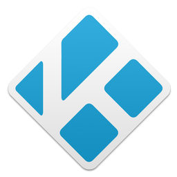</a></td>
<td valign="top"><a target="_blank" href="https://kodi.tv/"><strong>Kodi</strong></a> 
play video or audio from files or streams, including info and movie posters from TMDb <small><a target="_blank" href="https://github.com/PanderMusubi/fdroid/blob/main/README.md#kodi">MB</a> <a target="_blank" href="https://flathub.org/apps/tv.kodi.Kodi">FH</a> <a target="_blank" href="https://snapcraft.io/kodi-omega">SC</a> <a target="_blank" href="https://alternativeto.net/software/xbmc-media-center/about/">AT</a></small></td>
<td valign="top"><strong>Microsoft Media Player, Winamp, QuickTime, DVD Player, iTunes</strong></td></tr>
<tr id="spotube"><td></td>
<td valign="top"><a target="_blank" href="https://spotube.krtirtho.dev/"><strong>Spotube</strong></a> 
play Spotify without an account and no ads <small><a target="_blank" href="https://github.com/PanderMusubi/fdroid/blob/main/README.md#spotube">MB</a> <a target="_blank" href="https://flathub.org/apps/com.github.KRTirtho.Spotube">FH</a> <a target="_blank" href="https://alternativeto.net/software/spotube/about/">AT</a></small></td>
<td valign="top"><strong>Spotify</strong></td></tr>
<tr><th colspan="2"> Video Recording and Editing</th><th> Replaces</th></tr>
<tr id="obs-studio"><td></td>
<td valign="top"><a target="_blank" href="https://obsproject.com/"><strong>OBS Studio</strong></a> 
record and stream videos <small><a target="_blank" href="https://github.com/PanderMusubi/fdroid/blob/main/README.md#remote">MB</a> <a target="_blank" href="https://launchpad.net/~obsproject/+archive/ubuntu/obs-studio">AP</a> <a target="_blank" href="https://flathub.org/apps/com.obsproject.Studio">FH</a> <a target="_blank" href="https://snapcraft.io/obs-studio">SC</a> <a target="_blank" href="https://alternativeto.net/software/open-broadcaster-software/about/">AT</a></small></td>
<td valign="top"><strong>Camtasia, Snagit</strong></td></tr>
<tr id="shotcut"><td></td>
<td valign="top"><a target="_blank" href="https://www.shotcut.org/"><strong>Shotcut</strong></a> 
edit videos <small><a target="_blank" href="https://flathub.org/apps/org.shotcut.Shotcut">FH</a> <a target="_blank" href="https://snapcraft.io/shotcut">SC</a> <a target="_blank" href="https://alternativeto.net/software/shotcut/about/">AT</a> <a target="_blank" href="https://osalternative.to/project/shotcut">OA</a></small></td>
<td valign="top"><strong>Adobe Premiere Pro, Windows Movie Maker, iMovie, Pinnacle Studio, DaVinci Resolve</strong></td></tr>
<tr id="audacity"><td></td>
<td valign="top"><a target="_blank" href="https://www.audacityteam.org/"><strong>Audacity</strong></a> 
edit audio files <small><a target="_blank" href="https://flathub.org/apps/org.audacityteam.Audacity">FH</a> <a target="_blank" href="https://snapcraft.io/audacity">SC</a> <a target="_blank" href="https://alternativeto.net/software/audacity/about/">AT</a> <a target="_blank" href="https://osalternative.to/project/audacity">OA</a></small></td>
<td valign="top"><strong>Adobe Soundbooth, GarageBand, Sony Sound Forge</strong></td></tr>
<tr id="mediainfo"><td></td>
<td valign="top"><a target="_blank" href="https://mediaarea.net/MediaInfo"><strong>Mediainfo</strong></a> 
inspect media files <small><a target="_blank" href="https://github.com/PanderMusubi/fdroid/blob/main/README.md#yes">MB</a> <a target="_blank" href="https://flathub.org/apps/net.mediaarea.MediaInfo">FH</a> <a target="_blank" href="https://snapcraft.io/mediainfo-gui">SC</a> <a target="_blank" href="https://alternativeto.net/software/mediainfo/about/">AT</a></small></td>
<td valign="top"><strong>Microsoft Media Player, Winamp, QuickTime, DVD Player, iTunes</strong></td></tr>
<tr id="lmms"><td><a target="_blank" href="https://lmms.io/">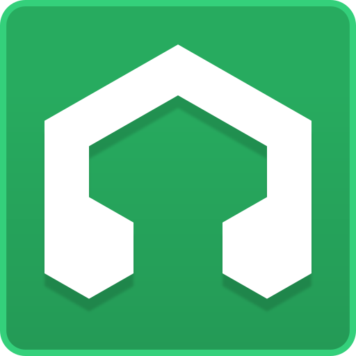</a></td>
<td valign="top"><a target="_blank" href="https://lmms.io/"><strong>LMMS</strong></a> 
compose, arrange, produce, (re)mix and master music <small><a target="_blank" href="https://flathub.org/apps/io.lmms.LMMS">FH</a> <a target="_blank" href="https://alternativeto.net/software/lmms/about/">AT</a> <a target="_blank" href="https://osalternative.to/project/lmms">OA</a></small></td>
<td valign="top"><strong>Ableton Live, Adobe Audition, FL Studio, Pro Tools, Logic Pro, GarageBand</strong></td></tr>
<tr id="mixxx"><td><a target="_blank" href="https://mixxx.org/">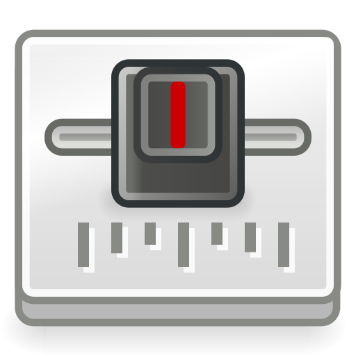</a></td>
<td valign="top"><a target="_blank" href="https://mixxx.org/"><strong>Mixxx</strong></a> 
mix music, supports MIDI and HID controllers <small><a target="_blank" href="https://launchpad.net/~mixxx/+archive/ubuntu/mixxx">AP</a> <a target="_blank" href="https://flathub.org/apps/org.mixxx.Mixxx">FH</a> <a target="_blank" href="https://alternativeto.net/software/mixxx/about/">AT</a> <a target="_blank" href="https://osalternative.to/project/mixxx">OA</a></small></td>
<td valign="top"><strong>rekordbox, Traktor Pro, Serato DJ, VirtualDJ, Cross DJ, djay Pro, DJUCED</strong></td></tr>
<tr><th colspan="2"> Office Suite</th><th> Replaces</th></tr>
<tr id="libreoffice-writer"><td><a target="_blank" href="https://www.libreoffice.org/">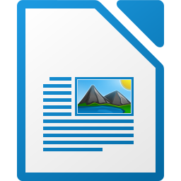</a></td>
<td valign="top"><a target="_blank" href="https://www.libreoffice.org/"><strong>LibreOffice Writer</strong></a> 
word processor <small><a target="_blank" href="https://launchpad.net/~libreoffice/+archive/ubuntu/ppa">AP</a> <a target="_blank" href="https://flathub.org/apps/org.libreoffice.LibreOffice">FH</a> <a target="_blank" href="https://snapcraft.io/libreoffice">SC</a> <a target="_blank" href="https://alternativeto.net/software/libreoffice-writer/about/">AT</a> <a target="_blank" href="https://osalternative.to/project/libreoffice-writer">OA</a></small></td>
<td valign="top"><strong>Microsoft Office Word</strong></td></tr>
<tr id="libreoffice-calc"><td><a target="_blank" href="https://www.libreoffice.org/">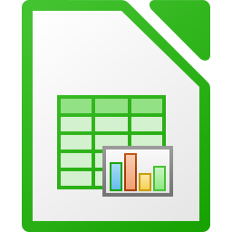</a></td>
<td valign="top"><a target="_blank" href="https://www.libreoffice.org/"><strong>LibreOffice Calc</strong></a> 
spreadsheet <small><a target="_blank" href="https://launchpad.net/~libreoffice/+archive/ubuntu/ppa">AP</a> <a target="_blank" href="https://flathub.org/apps/org.libreoffice.LibreOffice">FH</a> <a target="_blank" href="https://snapcraft.io/libreoffice">SC</a> <a target="_blank" href="https://alternativeto.net/software/libreoffice---calc/about/">AT</a> <a target="_blank" href="https://osalternative.to/project/libreoffice---calc">OA</a></small></td>
<td valign="top"><strong>Microsoft Office Excel</strong></td></tr>
<tr id="libreoffice-impress"><td></td>
<td valign="top"><a target="_blank" href="https://www.libreoffice.org/"><strong>LibreOffice Impress</strong></a> 
presentation <small><a target="_blank" href="https://launchpad.net/~libreoffice/+archive/ubuntu/ppa">AP</a> <a target="_blank" href="https://flathub.org/apps/org.libreoffice.LibreOffice">FH</a> <a target="_blank" href="https://snapcraft.io/libreoffice">SC</a> <a target="_blank" href="https://alternativeto.net/software/libreoffice-impress/about/">AT</a> <a target="_blank" href="https://osalternative.to/project/libreoffice-impress">OA</a></small></td>
<td valign="top"><strong>Microsoft Office PowerPoint</strong></td></tr>
<tr id="libreoffice-base"><td><a target="_blank" href="https://www.libreoffice.org/">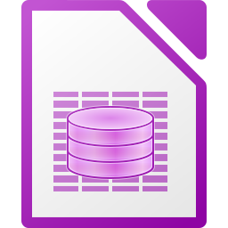</a></td>
<td valign="top"><a target="_blank" href="https://www.libreoffice.org/"><strong>LibreOffice Base</strong></a> 
database <small><a target="_blank" href="https://launchpad.net/~libreoffice/+archive/ubuntu/ppa">AP</a> <a target="_blank" href="https://flathub.org/apps/org.libreoffice.LibreOffice">FH</a> <a target="_blank" href="https://snapcraft.io/libreoffice">SC</a> <a target="_blank" href="https://alternativeto.net/software/libreoffice-base/about/">AT</a> <a target="_blank" href="https://osalternative.to/project/libreoffice-base">OA</a></small></td>
<td valign="top"><strong>Microsoft Office Access</strong></td></tr>
<tr id="libreoffice-draw"><td><a target="_blank" href="https://www.libreoffice.org/">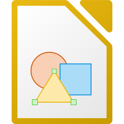</a></td>
<td valign="top"><a target="_blank" href="https://www.libreoffice.org/"><strong>LibreOffice Draw</strong></a> 
drawing <small><a target="_blank" href="https://launchpad.net/~libreoffice/+archive/ubuntu/ppa">AP</a> <a target="_blank" href="https://flathub.org/apps/org.libreoffice.LibreOffice">FH</a> <a target="_blank" href="https://snapcraft.io/libreoffice">SC</a> <a target="_blank" href="https://alternativeto.net/software/libreoffice---draw/about/">AT</a> <a target="_blank" href="https://osalternative.to/project/libreoffice---draw">OA</a></small></td>
<td valign="top"><strong>Microsoft Office Draw</strong></td></tr>
<tr id="libreoffice-math"><td><a target="_blank" href="https://www.libreoffice.org/">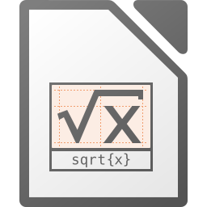</a></td>
<td valign="top"><a target="_blank" href="https://www.libreoffice.org/"><strong>LibreOffice Math</strong></a> 
mathematical formulas <small><a target="_blank" href="https://launchpad.net/~libreoffice/+archive/ubuntu/ppa">AP</a> <a target="_blank" href="https://flathub.org/apps/org.libreoffice.LibreOffice">FH</a> <a target="_blank" href="https://snapcraft.io/libreoffice">SC</a> <a target="_blank" href="https://alternativeto.net/software/libreoffice-math/about/">AT</a> <a target="_blank" href="https://osalternative.to/project/libreoffice-math">OA</a></small></td>
<td valign="top"><strong>Microsoft Office MathTyoe</strong></td></tr>
<tr><th colspan="2"> Graphics and Publishing</th><th> Replaces</th></tr>
<tr id="gimp"><td></td>
<td valign="top"><a target="_blank" href="https://gimp.org/"><strong>GIMP</strong></a> 
image manipulation <small><a target="_blank" href="https://flathub.org/apps/org.gimp.GIMP">FH</a> <a target="_blank" href="https://snapcraft.io/gimp">SC</a> <a target="_blank" href="https://alternativeto.net/software/gimp/about/">AT</a> <a target="_blank" href="https://osalternative.to/project/gimp">OA</a></small></td>
<td valign="top"><strong>Adobe Illustrator, Corel Paint Shop Pro Photo</strong></td></tr>
<tr id="inkscape"><td><a target="_blank" href="https://inkscape.org/">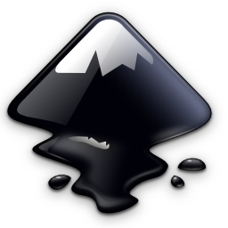</a></td>
<td valign="top"><a target="_blank" href="https://inkscape.org/"><strong>Inkscape</strong></a> 
vector drawing <small><a target="_blank" href="https://launchpad.net/~inkscape.dev/+archive/ubuntu/stable">AP</a> <a target="_blank" href="https://flathub.org/apps/org.inkscape.Inkscape">FH</a> <a target="_blank" href="https://snapcraft.io/inkscape">SC</a> <a target="_blank" href="https://alternativeto.net/software/inkscape/about/">AT</a></small></td>
<td valign="top"><strong>Adobe Illustrator, Adobe Fireworks, CorelDRAW</strong></td></tr>
<tr id="krita"><td><a target="_blank" href="https://krita.org/">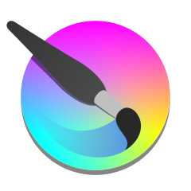</a></td>
<td valign="top"><a target="_blank" href="https://krita.org/"><strong>Krita</strong></a> 
drawing <small><a target="_blank" href="https://flathub.org/apps/org.kde.krita">FH</a> <a target="_blank" href="https://snapcraft.io/krita">SC</a> <a target="_blank" href="https://alternativeto.net/software/krita/about/">AT</a></small></td>
<td valign="top"><strong>Microsoft Paint, Painting</strong></td></tr>
<tr id="darktable"><td><a target="_blank" href="https://www.darktable.org/">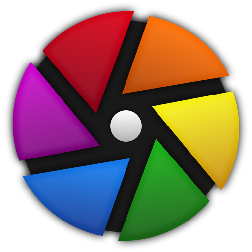</a></td>
<td valign="top"><a target="_blank" href="https://www.darktable.org/"><strong>darktable</strong></a> 
image manipulation <small><a target="_blank" href="https://flathub.org/apps/org.darktable.Darktable">FH</a> <a target="_blank" href="https://snapcraft.io/darktable">SC</a> <a target="_blank" href="https://alternativeto.net/software/darktable/about/">AT</a> <a target="_blank" href="https://osalternative.to/project/darktable">OA</a></small></td>
<td valign="top"><strong>Adobe Lightroom</strong></td></tr>
<tr id="scribus"><td></td>
<td valign="top"><a target="_blank" href="https://scribus.net/"><strong>Scribus</strong></a> 
desktop publishing (DTP) <small><a target="_blank" href="https://flathub.org/apps/net.scribus.Scribus">FH</a> <a target="_blank" href="https://alternativeto.net/software/scribus/about/">AT</a></small></td>
<td valign="top"><strong>Adobe InDesign, Adobe FrameMaker, QuarkXPress</strong></td></tr>
<tr><th colspan="2"> Financial</th><th> Replaces</th></tr>
<tr id="dash"><td></td>
<td valign="top"><a target="_blank" href="https://www.dash.org/"><strong>Dash</strong></a> 
send and receive anonymously the cryptocurrency Dash <small><a target="_blank" href="https://github.com/PanderMusubi/fdroid/blob/main/README.md#dash-wallet">MB</a> <a target="_blank" href="https://flathub.org/apps/org.dash.dash-core">FH</a> <a target="_blank" href="https://alternativeto.net/software/darkcoin/about/">AT</a></small></td>
<td valign="top"><strong>PayPal, American Express, Visa, Mastercard, Bitcoin</strong></td></tr>
<tr id="firo"><td></td>
<td valign="top"><a target="_blank" href="https://firo.org/"><strong>Firo</strong></a> 
send and receive anonymously the cryptocurrency Firo <small><a target="_blank" href="https://flathub.org/apps/org.firo.firo-qt">FH</a> <a target="_blank" href="https://alternativeto.net/software/zcoin/about/">AT</a></small></td>
<td valign="top"><strong>PayPal, American Express, Visa, Mastercard, Bitcoin</strong></td></tr>
<tr id="beldex"><td></td>
<td valign="top"><a target="_blank" href="https://beldex.io/"><strong>Beldex</strong></a> 
send and receive anonymously the cryptocurrency Beldex <small><a target="_blank" href="https://deb.beldex.io/apt-repo/">AP</a></small></td>
<td valign="top"><strong>PayPal, American Express, Visa, Mastercard, Bitcoin</strong></td></tr>
<tr id="monero"><td></td>
<td valign="top"><a target="_blank" href="https://www.getmonero.org/"><strong>Monero</strong></a> 
send and receive anonymously the cryptocurrency Monero <small><a target="_blank" href="https://flathub.org/apps/org.getmonero.Monero">FH</a> <a target="_blank" href="https://alternativeto.net/software/monero/about/">AT</a></small></td>
<td valign="top"><strong>PayPal, American Express, Visa, Mastercard, Bitcoin</strong></td></tr>
</table>

Please, also consider installing [Firefox add-ons](https://addons.mozilla.org/en-US/firefox/collections/Hellebaard/favorites/) and [Thunderbird add-ons](https://addons.thunderbird.net/en-US/thunderbird/collections/Hellebaard/favorites/).

See also:
- [Selection of FOSS Android apps on F-Droid](https://github.com/PanderMusubi/fdroid/blob/main/README.md)
- [PRISM Break](https://prism-break.org/en/)

This overview was started in 2013 and predates that of PRISM Break.

